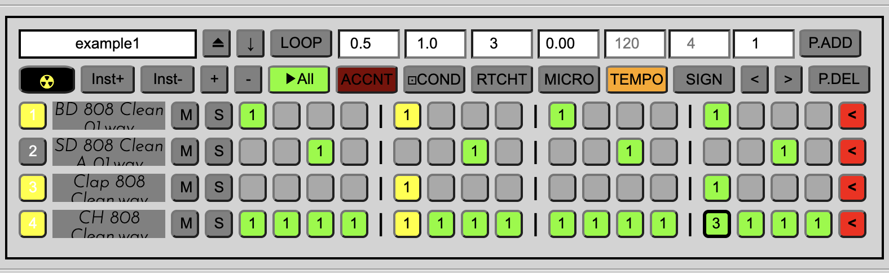
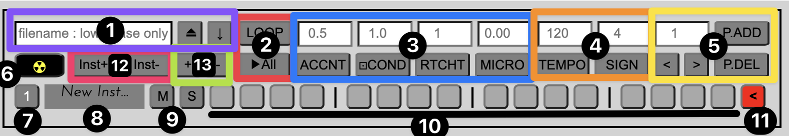
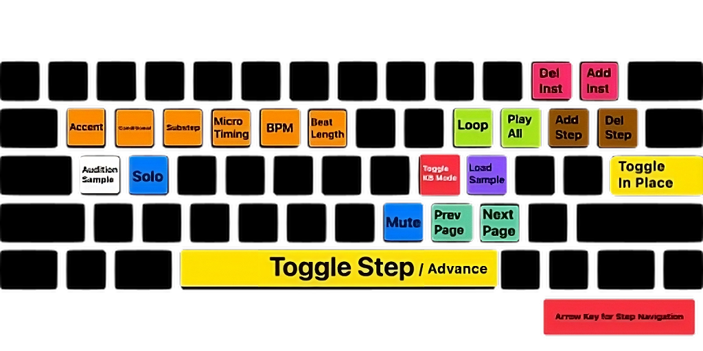

## BaseDrum
BaseDrum is a web-based 'Drum Pattern Playground' where you can experiment with various rhythmic elements.  
The individual sounds are not the main concern here - rather it's more about the rhythm and dynamics!

## Features
1. BaseDrum DOES NOT place artificial limitations on well... most of things.  
If you want a 2-minute sequence of 8 parts with 17/5 time signature running at 200BPM, then go for it! (Note: Unfound Claim.)  
The sky, and my HTML + CSS + JS spaghetti "code" is the limit.

2. BaseDrum features precise per-step manipulations, like:  
- Accents (Default at 50% = 0.5, 0% ~ 100%)
- Conditionals (Default at 100% = 1.0, 0% ~ 100%)
- Substeps (Default at 1, maximum of 5)
- Microtiming\* (Default at 0 delay ~ +50% delay)

\* Note: If you know how to implement negative microtiming, and therefore swings(shuffles) then feel free to contribute!

3. File manipulation - Sample import / Pattern Save & Load!  
Since I do not have any ability or whatsoever to tinker with the backend, there is literally no way for myself to store your information.  
Please be assured that everything you do in BaseDrum is done locally.  
(Technically, samples are loaded as links to your audio files, and patterns are saved / loaded as HTML files.
When saving patterns, links to your audio files are automatically erased for added security when sharing patterns.)   

5. Maximum Blinkiness!  
After all, that's what you came for, is it not?

## Interface

1. File management : Filename input / display - Upload - Download
   - Files are downloaded / uploaded as HTML files with 'bdv(major version number)-' prefix.
2. Playback control : Loop (one pattern) - Play All (through all patterns)
3. Step parameter control : Accent - Conditional - Substep - Microtiming
   - After a particular step is toggled, its parameters will be displayed on this section.
   - You can then manipulate those values to perform per-step manipulations.
4. Project parameter Control : Tempo (BPM) / Length of a beat
   - 1 Tick = (60000 ms) / (bpm * beat length)
5. Page Management : Current page display / input - Navigation buttons - Add page - Delete page
   - The target of page addition / deletion is always the last page.
6. Erase all (Nuke) button
   - Erases everything except instrument tracks, BPM, and beat length.
6.5. Randomize Steps (Not visible, the red button with a white dice)  
   - Can randomize a row, or the whole pattern
7. Track (Row) clear button + Track trigger indicator
8. Instrument (Sample) load / display section
   - Samples are loaded as (local) links to your audio files.
   - Tip: You can even replace samples while playing through a pattern!
9. Mute / Solo button / indicator
10. Steps
    - Default setup: 16 steps per pattern, 4 steps = 1 beat
    - Per-step parameters will be also reflected here visually:
      - Accent : The text content gets redder
      - Conditional : 'X' will be displayed whenever the step isn't triggered
      - Substep : Displayed as the text content
      - Microtiming : Substep text will be shifted to the right
    - Also, beat dividers will be adjusted accordingly as you change beat length / steps per pattern.
11. Last page indicator / Sample audition button
    - Green when there are more pages ahead, red when it's the last page.
12. Instrument (Sample) Add / Delete button
    - In a smiliar manner to page manipulation, the last instrument becomes the target.
13. Steps per pattern (Column) Add / Delete button
    - Again, it's the last step that gets affected first.
   
## Keyboard Shortcuts
When the 'Keyboard Mode' is toggled on with 'K', those additional inputs will be available :

 
## License
- You are free to use this application (BaseDrum) as-is (with no warranty provided, so if anything bad happens I cannot take any responsibility).
- You can also modify its code to your heart's content and publish even better version of BaseDrum, but make sure **you also share your source code** (Pay forward!)  
  - (Though I would appreciate direct contributions for my learning)
- If you decide to make money with BaseDrum and my code, do contact me through davidk1118@gmail.com.
  - You can also use the same e-mail address to :
    - Say thanks,
    - Report a bug (there's an issue tracker for that though...),
    - or (even better) provide me with good career opportunities. (No spam please. Had enough with Python.)

My intention of making BaseDrum was to share the joy of crafting drum patterns with everyone (even those without software(DAW)/hardware drum sequencers).  
At least I had a lot of fun with it, and I hope you can have some fun too! (Also hope there are no critical bugs anymore...)  

Made with ❤️ from 🇰🇷 by Resoluxe (Minsoo Kang)  
